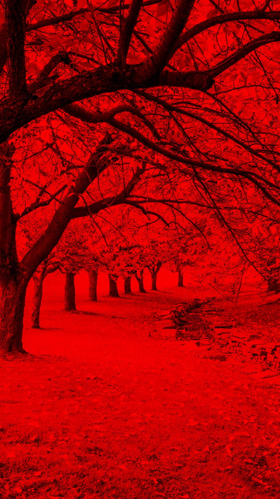
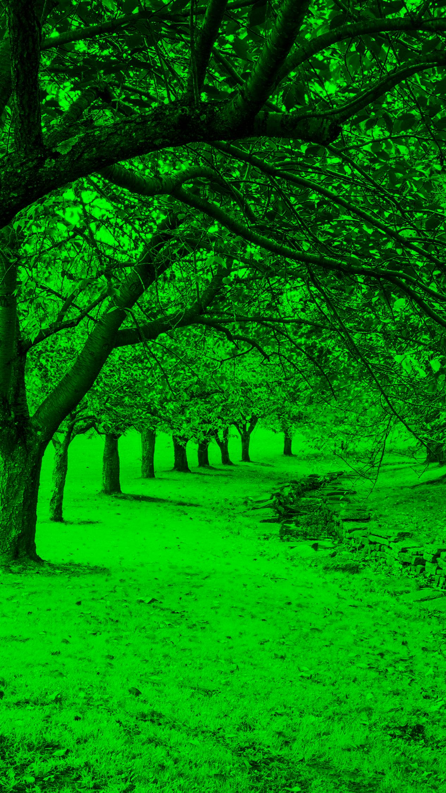
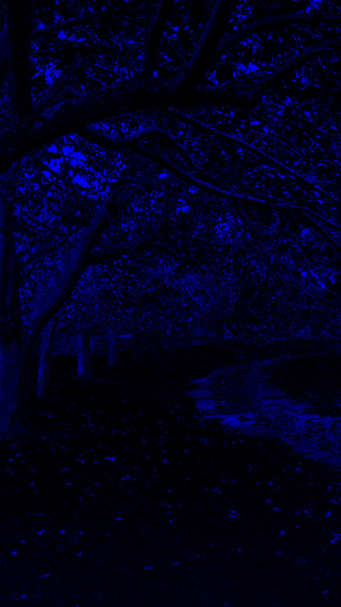
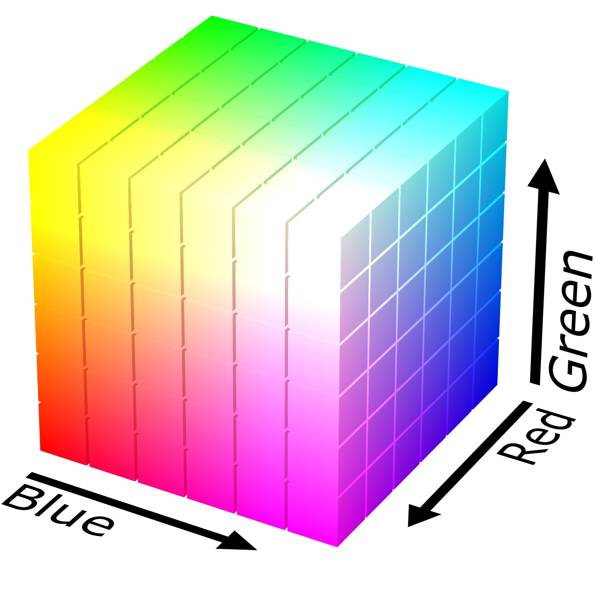

## Introduzione
Le lezioni sulla teoria del colore si focalizzano sullo studio del modello RGB e del modello HSV.

[Torna alla homepage](./)

## Decomposizione RGB

## Modello geometrico di RGB
Avendo tre canali indipendenti che variano tra 0 e 1, la geometria del modello RGB è un cubo 3-dimensionale.

